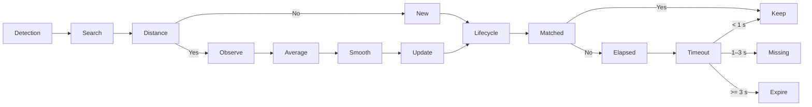
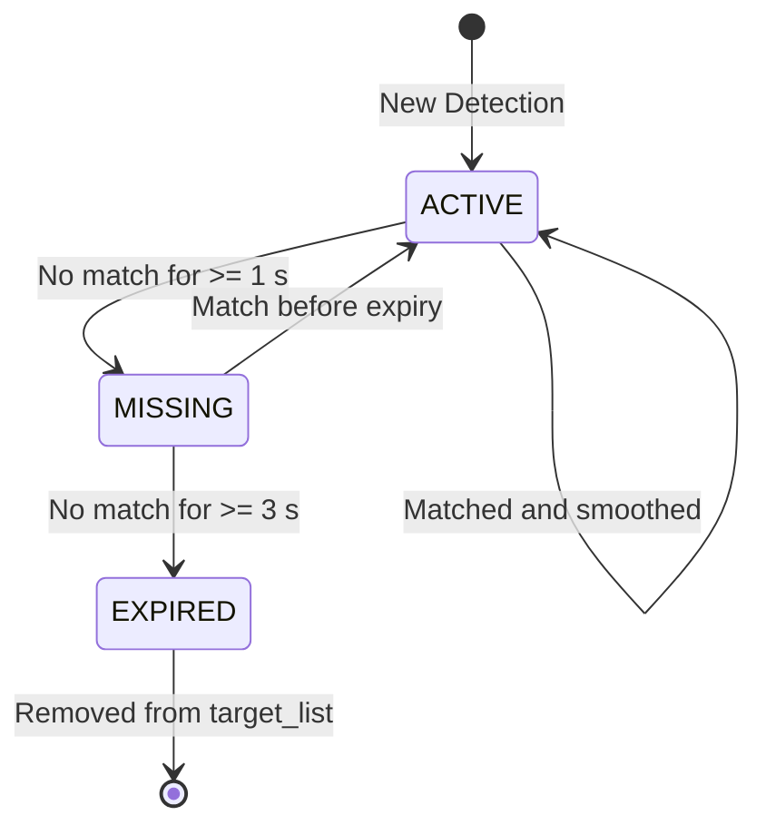
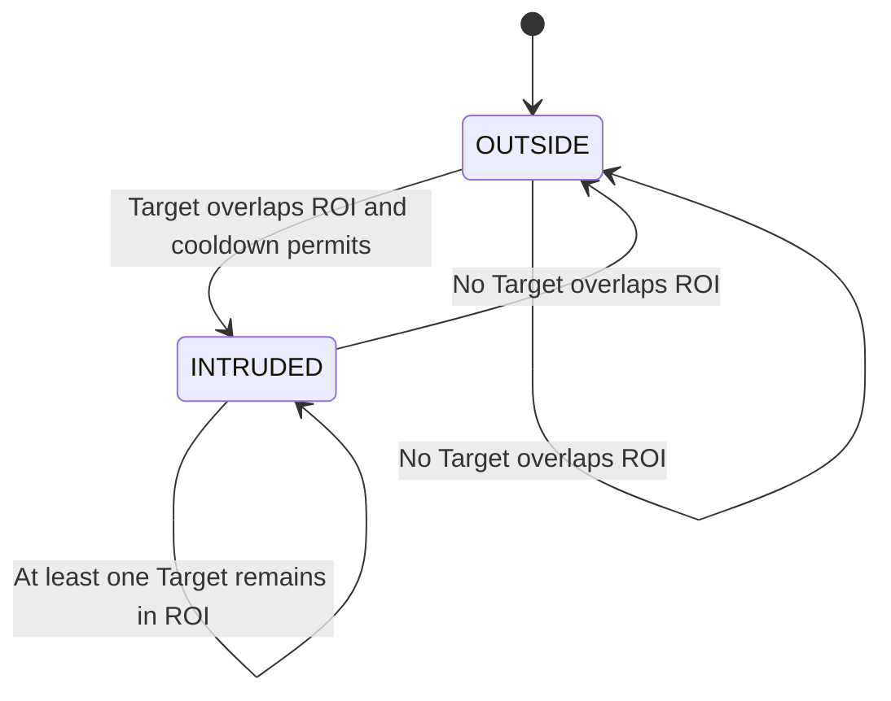

# Vision Guardian System 仕様書　(かつ機能仕様書)

>***バージョン***: v0.2(現行実装);
>***位置付け***: Local-first / Edge AI による単一カメラ型の人物ROI侵入監視プロトタイプ(ローカル環境で動作);
>***コアバリュー***: 監視カメラからのデータを、YOLOによるフレーム単位で、対象を識別し、そして時系列状態・ノイズ抑制を備えたデータへ変換する;そのうえで、ローカル環境でアラート・スクリーンショット保存・ログ記録までを実行する.

## 1. システム概要
VisionGuardian（VG）は、製造現場・施工現場・小規模オフィスなど、映像監視を必要とする環境を対象とするシステムである.監視カメラから映像フレームを取得し、YOLOによってターゲットを検出・追跡し、矩形のRegion of Interest（ROI）への侵入を判定する.ターゲットが侵入条件を満たすと、イベントを生成し、証拠画像を保存する.
**対応範囲**
1. 単一USBカメラによるリアルタイム映像処理とOpenCVウィンドウ表示;
2. YOLOによる `person` Detection（信頼度閾値を設定可能）;
3. 中心点間距離に基づく軽量なTarget Trackingと安定した `target_id` の管理 ;
4. 直近5回の観測値に基づく移動平均によるjitter suppression ;
5. `ACTIVE` / `MISSING` / `EXPIRED` によるTargetライフサイクル管理 ;
6. 矩形ROIへの侵入判定、グローバルな侵入状態管理、10秒間のcooldown ;
7. console Warning、スクリーンショット撮り、ログ記録 ;
**対応範囲外**
- マルチカメラ、カメラ間Re-identification、DeepSORT / ByteTrack;
- データベース、Web API、Dashboard、ユーザー権限、クラウド環境への展開;
- Polygon ROI、メール・Slack等による通知、モデル学習・管理など...


## 2. システム構造
***フローチャート***
Camera → Pipeline → Detector → Tracker → EventEngine → ActionHandler
       　 └→Visualizer    　　　　　　　　　　　　　　　　　　├→ Warning
                        　　　　　　　　　　　　　　　　　　　├→ Screenshot
                        　　　　　　　　　　　　　　　　　　　└→ Log
***モジュール***
| 層 / モジュール | 主な役割 | 入力 | 出力 |
|:---|:---|:---|:---|:---|
| `main.py`       | カメラのライフサイクル管理、各モジュールのフレーム単位の制御 | Camera frame | 可視化・副作用 |
| `detector.py`   | YOLO推論、`person` の検出 | Frame | `Detection[]` |
| `tracker.py`    | Targetのマッチング、平滑化、ロスト状態管理 | `Detection[]` | `Target[]` |
| `events.py`     | ROI侵入状態の判定、Event生成 | `Target[]`, Frame | `Event[]` |
| `actions.py`    | `intrusion` Eventの処理 | `Event[]` | Warning、スクリーンショット、ログ |
| `visualizer.py` | ROI、Target bbox、状態の描画 | Frame, `Target[]` | 可視化済みFrame |
| `config.py`     | 閾値・パス等の設定管理 | - | 設定値 |


## 3. プロセスフロー
VGはカメラフレームを継続的に取得する;
なお、Detection / Tracking / Eventの処理は`DETECTION_INTERVAL=3`フレームごとに実行する;
その他のフレームでは、直前に取得したTargetの状態を表示する.
Start
  ↓
Camera
  ↓
Frame
  ↓
Detection interval?
  ├─ Yes → Detect → Track → Event → Action ─┐
  │                                          ↓
  └─ No ───────────────────────────────→ Display
                                             ↓
                                            Quit
                                          ↙      ↘
                                        No        Yes
                                        ↓          ↓
                                      Frame       End

## 4. Target Tracking 仕様
### 4.1 Target データモデル

| フィールド | 説明 |
|:---|:---|
| `target_id` | Tracker内で採番するローカルなインスタンスID, YOLOのclass IDとは異なる; |
| `bbox` | 平滑化後の`(x1, y1, x2, y2)`,幅・高さは最新Detection、中心点は過去の観測値から算出する; |
| `confidence` | 最新Detectionの信頼度; |
| `last_seen` | 最後に正常にマッチングした時刻; |
| `state` | `ACTIVE`、`MISSING`、`EXPIRED` のいずれか; |
| `center_history` | 直近5回分のbbox中心点を保持する固定長キュー; |
### 4.2 Tracking フロー

### 4.3 Target 状態遷移


## 5. 入侵事件仕様
### 5.1 判定ルール
1. EventEngine は、現在のEXPIREDでないTargetを順に処理する;
2. bboxとROIが矩形として交差している場合、そのフレームではROIへの侵入と判定する;
3. グローバル状態が「侵入者なし」から「1名以上の侵入者あり」に切り替わった場合のみ、intrusion Eventの生成を試みる;
4. 前回のEvent生成からCOOL_DOWN=10秒未満の場合、新しいEventは生成しない;
5. TargetがROI内に留まっている間は重複してAlertを発生させず、すべてのTargetがROI外に出た時点でグローバル状態をリセットする.

### 5.2 Event データモデル
| フィールド | 説明 |
|:---|:---|
| `event_type` | 現在は`intrusion`に固定 |
| `confidence` | Eventを発生させたTargetの最新Detectionの信頼度 |
| `bbox` | Event発生時の平滑化済みbbox|
| `timestamp` | Event生成時刻 |
| `frame` | Event発生時の元のOpenCV Frame,スクリーンショット保存に使用する|
### 5.3 Action 動作
| Event | 動作 | ローカルでの結果 |
|:---|:---|:---|
| `intrusion` | Warningを出力 | Console |
| `intrusion` | 発生時のFrameを保存 | `screenshots/` |
| `intrusion` | Event記録を書き込む | `logs/event.log` |

### 6. 主要設定
| 設定 | 現在値 | 説明 |
|:---|---:|:---|
| Camera index | `0` | 現在の`main.py`で固定使用しているUSB Cameraのインデックス.`CAMERA_INDEX`設定値は未接続. |
| `MODEL_PATH` | `models/yolo11n.pt` | YOLOモデルのパス |
| `CONF_THRESHOLD` | `0.25` | YOLO Detectionの最低信頼度 |
| `DETECTION_INTERVAL` | `3` | 3フレームごとにDetection / Tracking / Eventを実行する |
| `ROI` | `(100, 100, 200, 200)` | 矩形の監視領域 |
| `PERMITTED_RANGE` | `100` | Targetマッチング時の距離閾値.コード上ではこの値の二乗と比較する|
| `JITTER_HISTORY_SIZE` | `5` | bbox中心点の平滑化に使用する履歴長 |
| `TARGET_MISSING_TIMEOUT_SEC` | `1.0` | `MISSING`へ遷移するまでの時間閾値|
| `TARGET_EXPIRE_TIMEOUT_SEC` | `3.0` | Targetを削除するまでの時間閾値 |
| `COOL_DOWN` | `10` | 2つのEvent生成間に必要な最短時間（秒） |

### 7. 実行・検証
```bash
pip install -r requirements.txt
python3 main.py
```

OpenCVウィンドウ上でqキーを押すと、正常に終了する.
Trackerのjitter suppressionに関する単体テストは、以下のコマンドで実行できる:

```bash
python3 -m unittest discover -s tests
```

### 8. 現在の制約と今後の方向性
- 単一カメラによるローカル動作のプロトタイプであり、サーバー側の永続化やリモートアクセスには対応していない;
- Targetのマッチングは最近傍の中心点を用いた軽量な実装であり、現時点では遮蔽、交差移動、カメラ間でのID維持には対応していない;
- Event状態はグローバルなatleast_one_intruderで管理しており、Targetごとの独立した侵入Eventには未対応;
- ENTER_THRESHOLD / EXIT_THRESHOLD は定義済みだが、現在のEvent判定では二値の矩形交差判定を使用している.面積比を算出するcal_overlap_rate()は未接続のため、現時点では「交差 / 非交差」と同等の判定となり、実質的な面積ベースのヒステリシスにはなっていない;
- 今後の優先事項は、面積重複率によるヒステリシス、TargetごとのEvent状態管理、複数Targetの1対1マッチング、およびHTTP API / Dashboardへの対応.