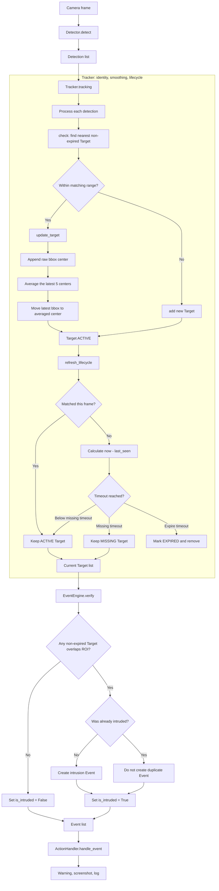
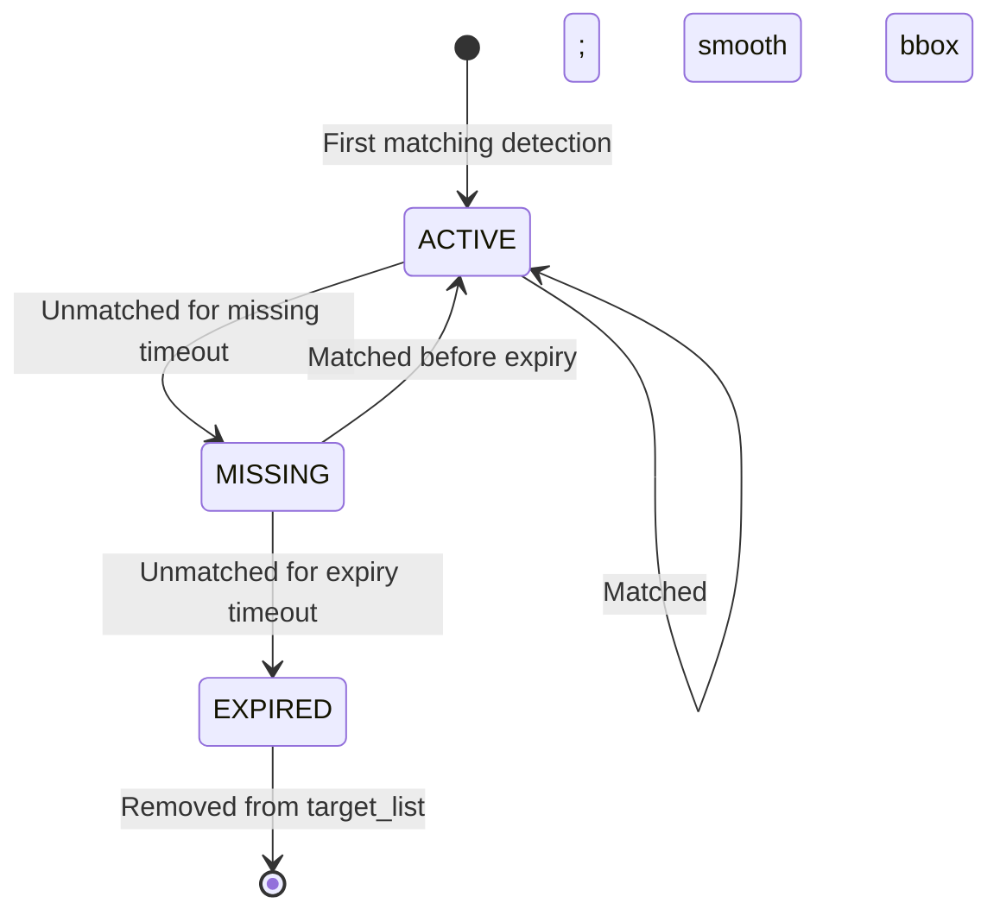

# VisionGuardian v0.2 Logic Flow

```mermaid
flowchart TD
    Frame[Camera frame] --> Detect[Detector.detect]
    Detect --> Detections[Detection list]
    Detections --> Track[Tracker.tracking]

    subgraph Tracking[Tracker: identity, smoothing, lifecycle]
        Track --> EachDetection[Process each detection]
        EachDetection --> FindClosest[check: find nearest non-expired Target]
        FindClosest --> Match{Within matching range?}
        Match -- Yes --> Update[update_target]
        Match -- No --> Create[add new Target]
        Create --> Active[Target ACTIVE]
        Update --> History[Append raw bbox center]
        History --> Average[Average the latest 5 centers]
        Average --> Smooth[Move latest bbox to averaged center]
        Smooth --> Active
        Active --> Lifecycle[refresh_lifecycle]
        Lifecycle --> Seen{Matched this frame?}
        Seen -- Yes --> Keep[Keep ACTIVE Target]
        Seen -- No --> MissingTime[Calculate now - last_seen]
        MissingTime --> State{Timeout reached?}
        State -- Below missing timeout --> Keep
        State -- Missing timeout --> Missing[Keep MISSING Target]
        State -- Expire timeout --> Expired[Mark EXPIRED and remove]
        Missing --> OutputTargets[Current Target list]
        Keep --> OutputTargets
    end

    OutputTargets --> Verify[EventEngine.verify]
    Verify --> Roi{Any non-expired Target overlaps ROI?}
    Roi -- No --> Outside[Set is_intruded = False]
    Roi -- Yes --> Transition{Was already intruded?}
    Transition -- No --> Event[Create intrusion Event]
    Transition -- Yes --> Hold[Do not create duplicate Event]
    Event --> SetInside[Set is_intruded = True]
    Hold --> SetInside
    SetInside --> Events[Event list]
    Outside --> Events
    Events --> Handle[ActionHandler.handle_event]
    Handle --> Action[Warning, screenshot, log]
```

## State transitions

```mermaid
stateDiagram-v2
    [*] --> ACTIVE: First matching detection
    ACTIVE --> ACTIVE: Matched; smooth bbox
    ACTIVE --> MISSING: Unmatched for missing timeout
    MISSING --> ACTIVE: Matched before expiry
    MISSING --> EXPIRED: Unmatched for expiry timeout
    EXPIRED --> [*]: Removed from target_list
```
