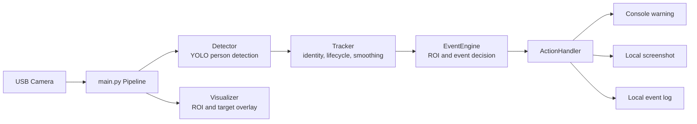
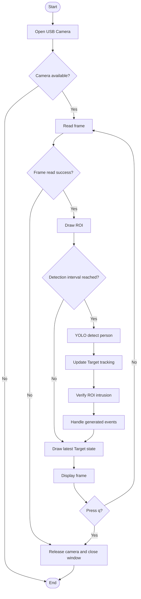
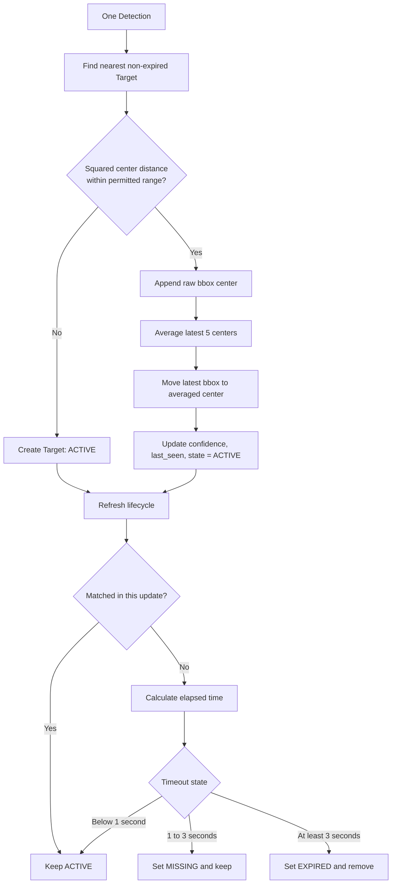
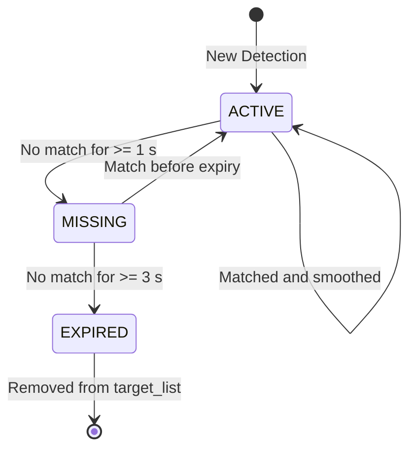
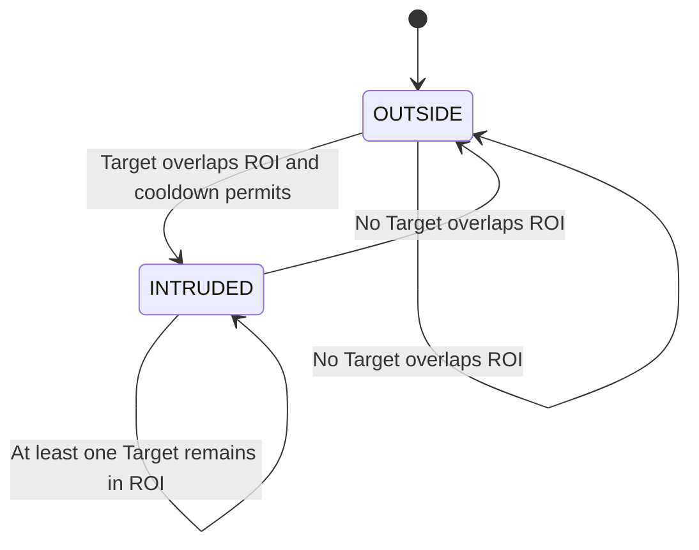

# VisionGuardian 系统规格书 / 功能规格书

> **版本**：v0.2（当前实现）  
> **定位**：Local-first、Edge AI 的单摄像头人员 ROI 入侵监控原型  
> **核心价值**：将 YOLO 的逐帧 Detection 转换为具备身份、时序状态与去抖控制的 `intrusion` Event，并在本地执行告警、截图和日志记录。

## 1. 系统概述

VisionGuardian（VG）面向制造现场、施工现场及小型办公区等需要基础视觉监控的场景。系统从 USB Camera 获取视频帧，以 YOLO 识别 `person`，追踪目标并判断其是否进入矩形 Region of Interest（ROI）。只有在满足入侵条件且未受冷却时间限制时，系统才生成事件并保存证据。

**范围内能力**

- 单 USB Camera 的实时视频处理与 OpenCV 窗口显示。
- YOLO `person` Detection，置信度阈值可配置。
- 基于中心点距离的轻量 Target Tracking 与稳定 `target_id`。
- 最近 5 次观测中心点的移动平均（jitter suppression）。
- `ACTIVE` / `MISSING` / `EXPIRED` 目标生命周期管理。
- 矩形 ROI 入侵判定、全局入侵状态与 10 秒 cooldown。
- 控制台 Warning、事件截图、文本日志。

**范围外能力**

- 多摄像头、跨摄像头 Re-identification、DeepSORT / ByteTrack。
- 数据库、Web API、Dashboard、用户权限、云端部署。
- Polygon ROI、报警通知（邮件、Slack 等）和模型训练管理。

## 2. 系统结构



| 层 / 模块 | 主职责 | 输入 | 输出 |
| --- | --- | --- | --- |
| `main.py` | 摄像头生命周期、按帧编排各模块 | Camera frame | 可视化窗口与副作用 |
| `detector.py` | YOLO 推理并筛选 `person` | Frame | `Detection[]` |
| `tracker.py` | Target 匹配、平滑、丢帧状态 | `Detection[]` | `Target[]` |
| `events.py` | ROI 入侵状态与事件生成 | `Target[]`, Frame | `Event[]` |
| `actions.py` | 处理 intrusion Event | `Event[]` | Warning、截图、日志 |
| `visualizer.py` | 绘制 ROI、Target bbox 与状态 | Frame, `Target[]` | 已标注 Frame |
| `config.py` | 集中管理阈值与路径 | - | 配置常量 |

## 3. 主处理流程

系统持续读取 Camera Frame，但 Detection / Tracking / Event 每 `DETECTION_INTERVAL=3` 帧执行一次；其余帧显示上一次已知 Target 状态。



## 4. Target Tracking 规格

### 4.1 Target 数据模型

| 字段 | 说明 |
| --- | --- |
| `target_id` | Tracker 内递增的本地实例 ID；不等同于 YOLO class ID。 |
| `bbox` | 平滑后的 `(x1, y1, x2, y2)`。宽高来自最新 Detection，中心点来自历史平均。 |
| `confidence` | 最新 Detection 的置信度。 |
| `last_seen` | 最近一次成功匹配的时间。 |
| `state` | `ACTIVE`、`MISSING` 或 `EXPIRED`。 |
| `center_history` | 固定长度为 5 的原始 bbox 中心点队列。 |

### 4.2 Tracking 流程



### 4.3 Target 状态机



## 5. 入侵事件规格

### 5.1 判定与抑制规则

1. `EventEngine` 遍历当前非 `EXPIRED` Target。
2. bbox 与 ROI 存在矩形相交时，当前帧判为进入 ROI。
3. 全局状态从“无入侵者”切换到“至少一名入侵者”时，才尝试创建 `intrusion` Event。
4. 距上一次成功触发不足 `COOL_DOWN=10` 秒时，不创建新的 Event。
5. Target 持续在 ROI 内不会重复报警；当所有 Target 离开 ROI 后，全局状态复位。



### 5.2 Event 数据模型

| 字段 | 说明 |
| --- | --- |
| `event_type` | 当前固定为 `intrusion`。 |
| `confidence` | 触发事件 Target 的最新 Detection 置信度。 |
| `bbox` | 触发时的平滑 bbox。 |
| `timestamp` | Event 创建时间。 |
| `frame` | 触发时的原始 OpenCV Frame，用于截图。 |

### 5.3 Action 行为

| 事件 | 行为 | 本地结果 |
| --- | --- | --- |
| `intrusion` | 输出 Warning | Console |
| `intrusion` | 保存触发帧 | `screenshots/` |
| `intrusion` | 写入事件记录 | `logs/event.log` |

## 6. 关键配置

| 配置 | 当前值 | 含义 |
| --- | ---: | --- |
| Camera index | `0` | 当前 `main.py` 固定使用的 USB Camera 索引；`CAMERA_INDEX` 配置常量尚未接入。 |
| `MODEL_PATH` | `models/yolo11n.pt` | YOLO 模型路径。 |
| `CONF_THRESHOLD` | `0.25` | YOLO Detection 最低置信度。 |
| `DETECTION_INTERVAL` | `3` | 每 3 帧执行一次 Detection / Tracking / Event。 |
| `ROI` | `(100, 100, 200, 200)` | 矩形监控区域。 |
| `PERMITTED_RANGE` | `100` | Target 匹配距离阈值，代码按其平方比较。 |
| `JITTER_HISTORY_SIZE` | `5` | bbox 中心点平滑窗口大小。 |
| `TARGET_MISSING_TIMEOUT_SEC` | `1.0` | 进入 `MISSING` 的时间阈值。 |
| `TARGET_EXPIRE_TIMEOUT_SEC` | `3.0` | 移除 Target 的时间阈值。 |
| `COOL_DOWN` | `10` | 两次 Event 创建之间的最短秒数。 |

## 7. 运行与验证

```bash
pip install -r requirements.txt
python3 main.py
```

在 OpenCV 窗口按 `q` 正常结束。Tracker 的 jitter suppression 单元测试可通过以下命令运行：

```bash
python3 -m unittest discover -s tests
```

## 8. 当前限制与后续方向

- 单摄像头本地原型；不提供服务端持久化或远程访问。
- Target 匹配为最近中心点的轻量实现，尚不处理遮挡、交叉行走与跨摄像头身份保持。
- 事件状态为全局 `atleast_one_intruder`，多 Target 的独立入侵事件尚未实现。
- `ENTER_THRESHOLD` / `EXIT_THRESHOLD` 已预留，但当前调用的是二值矩形相交判定；面积比例 `cal_overlap_rate()` 尚未接入 Event 判定。因此现阶段阈值效果等价于“相交 / 不相交”，不构成真正的面积滞回。
- 后续优先级：接入面积重叠率滞回、每 Target 事件状态、多目标一对一匹配，以及 HTTP API / Dashboard。
